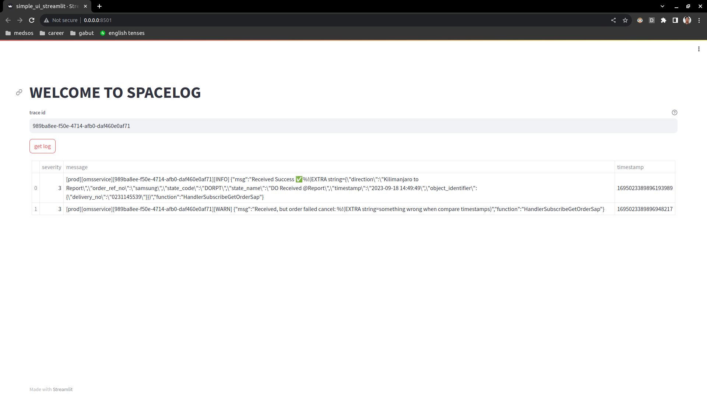
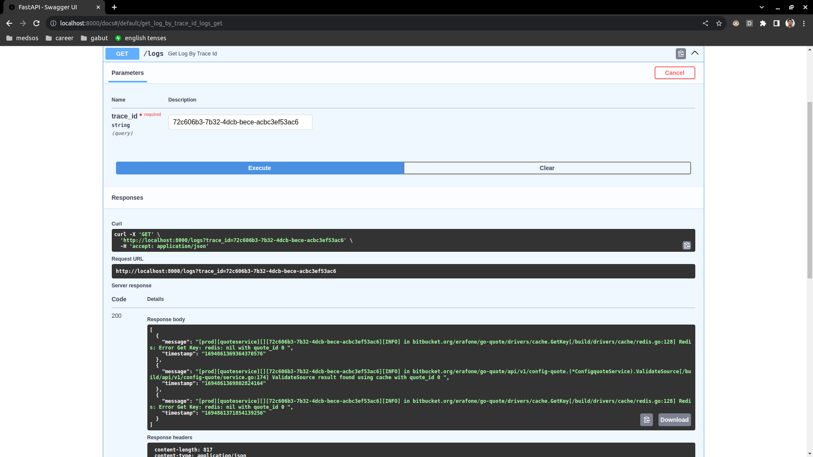

# Spacelog

Spacelog is an internal application of erajaya to get log.

## Quickstart using Docker Compose

This will start the Spacelog application and you can access the documentation at the provided URL. To quickly get Spacelog up and running using Docker Compose, follow these steps:

1. Rename `.env-example` to `.env` and update the value in that file.

2. Run the app using Docker Compose:

```bash
sudo docker compose up
```

3. Open Spacelog user interface on http://localhost:8501 in your web browser. In there you can use trace id to get log.



4. You can also open swagger docs http://localhost:8000/docs in your web browser. In there you can find api to get log by trace id.


